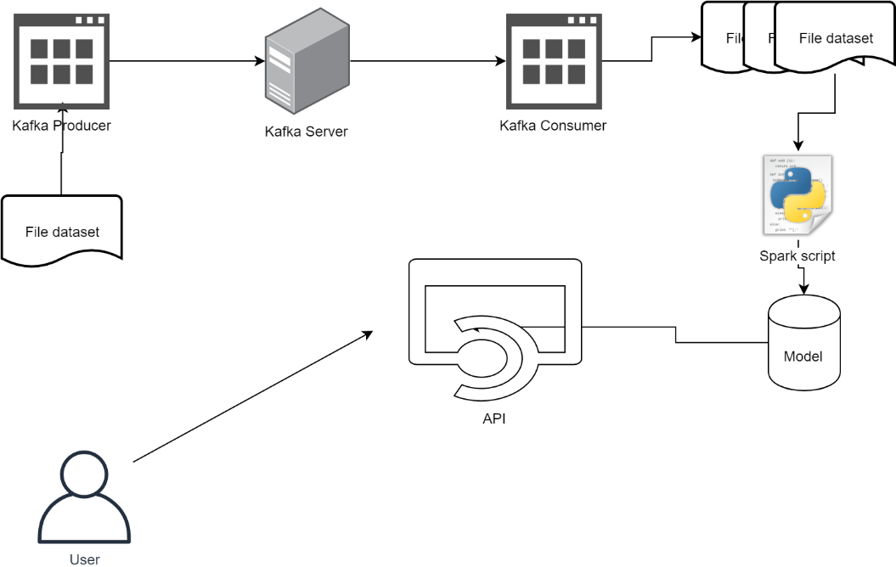

# Final Project Big Data

## Daftar Isi
- [Deskripsi Final Project](#deskripsi-final-project)
- [Database yang telah digunakan](#database-tugas)
- [Deskripsi Dataset](#deskripsi-dataset)

## Deskripsi Final Project

Terdapat sebuah sistem Big Data dengan arsitektur seperti gambar di atas. Sistem tersebut berfungsi untuk <b>menyimulasikan</b> pemrosesan data stream menggunakan <b>Kafka</b> dan <b>Apache Spark</b>.
Untuk kemudahan pemrosesan, Kafka Consumer tidak wajib menggunakan Spark Streaming.

Alur yang diharapkan adalah sebagai berikut:
 1. Terdapat sebuah file dataset yang akan dibaca secara sekuensial oleh Kafka Producer. <b>TIDAK DIPERBOLEHKAN MENGGUNAKAN DATASET YANG SUDAH DIGUNAKAN PADA TUGAS-TUGAS SEBELUMNYA</b>.
 2.	Kafka Producer akan mengirimkan data per baris ke Kafka Server seolah-olah sedang melakukan streaming. Proses ini dapat dilakukan dengan menambahkan <b>jeda</b>/<b>sleep</b> secara random agar data tidak dikirimkan secara langsung.
3. Kafka consumer membaca data yang ada di dalam Kafka server dan akan menyimpan data yang diterima dalam bentuk batch. Batch dapat ditentukan berdasarkan:
    - Jumlah data yang diterima.
    - Rentang waktu proses (<b>window</b>) 
    Sehingga nanti akan didapatkan beberapa file dataset sesuai dengan batch yang dipilih.
4. Spark script bertugas untuk melakukan training model sesuai dengan data yang masuk. Diharapkan ada beberapa model yang dihasilkan sesuai dengan jumlah data yang masuk. Kalian dapat menentukan sendiri berapa jumlah data yang diproses untuk tiap model. 
Contoh:
    1. Terdapat 3 model dengan skema sebagai berikut:
        - Model 1: Menggunakan data selama 5 menit pertama atau 500.000 data pertama.
        - Model 2: Menggunakan data selama 5 menit kedua atau 500.000 data kedua.
        - Model 3: Menggunakan data selama 5 menit ketiga atau 500.000 data ketiga.
    2. Terdapat 3 model dengan skema sebagai berikut:
        - Model 1: 1/3 data pertama
        - Model 2: 1/3 data pertama + 1/3 data kedua
        - Model 3: 1/3 data pertama + 1/3 data kedua + 1/3 data terakhir (semua data)
5. Model-model yang dihasilkan akan digunakan di dalam API. Buatlah endpoint sesuai dengan jumlah model yang ada.
6. User akan melakukan request ke API. API akan memberikan respon sesuai dengan request user. 
Misal:
    - Apabila user melakukan request rekomendasi, maka input yang diperlukan adalah rating dari user dan response yang diberikan adalah daftar rekomendasi.
    - Apabila modelnya adalah kasus clustering, maka response yang diberikan adalah ada di cluster mana data input dari user tersebut.

Refrensi: 
https://towardsdatascience.com/kafka-python-explained-in-10-lines-of-code-800e3e07dad1 
https://towardsdatascience.com/getting-started-with-apache-kafka-in-python-604b3250aa05 
https://stackoverflow.com/questions/46001807/dump-the-kafka-kafka-python-to-a-txt-file

## Database Tugas
- Pengenalan Apache Spark 
    Nama Database: [Daily Historical Stock Prices (1970 - 2018)](https://www.kaggle.com/ehallmar/daily-historical-stock-prices-1970-2018)
- Clustering Apache Spark 
    Nama Database: [Daily Historical Stock Prices (1970 - 2018)](https://www.kaggle.com/ehallmar/daily-historical-stock-prices-1970-2018)
- Frequent Pattern Mining 
    Nama Database: [Instacart Market Basket Analysis](https://www.kaggle.com/c/instacart-market-basket-analysis)
- Recommendation System 
    Nama Database: [Collaborative filtering dataset - dating agency](http://www.occamslab.com/petricek/data/)
- Final Project 
    Nama Database: [News Portal User Interactions by Globo.com](https://www.kaggle.com/gspmoreira/news-portal-user-interactions-by-globocom)

## Deskripsi Dataset
Dataset ini berisi <i>log</i>(<i>page views</i>) dari sebuah portal berita [Globo.com](https://www.globo.com/) yang berasal dari Brazil. Berisi data pada periode tanggal 1 Oktober 2017 hingga 16 Oktober 2017, termasuk data sebanyak 3 juta klik yang terdistribusi lebih dari 1 juta <i>sessions</i> dari 314.000 <i>users</i> yang membaca lebih dari 46.000 berita berbeda pada periode tersebut.
- Folder <b>click.zip</b> dengan file csv (<i>one per hour</i>), yang berisi <i>user id</i>.
- Kemudian setiap file csv digabung menjadi satu file dengan nama <b>clicks_hour.csv</b> mengunakan script python [berikut](src/combine.py), yang dijalankan pada folder hasil <i>extract</i> <b>click.zip</b>
    